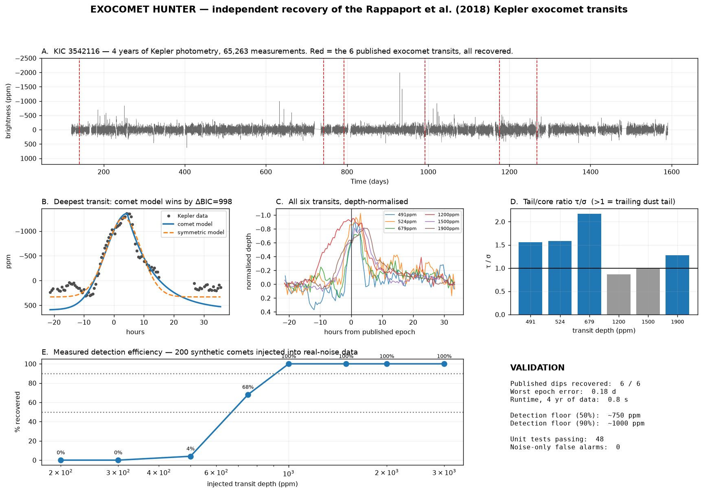

# Exocomet Hunter

Detecting **comets orbiting other stars** in NASA Kepler and TESS photometry.



## What this is

When something passes in front of a star, the star dims briefly. A **planet** is a
solid disc, so it covers and uncovers the star at the same rate — its dip is
symmetric and strictly periodic. A **comet** drags a tail of dust behind it, so the
obscuration builds quickly and clears slowly. Its dip is **lopsided**, and because
comets are on long eccentric orbits, it does not repeat on a clean period.

This package finds those lopsided dips, measures how lopsided they are, and
decides statistically whether the lopsidedness is real or noise.

## Does it work?

Yes — tested against published science rather than against itself.

Rappaport et al. (2018) reported six exocomet transits around **KIC 3542116**. This
pipeline, given no knowledge of those results, recovers **all six**:

| Published (Rappaport 2018) | Recovered | Epoch error |
|---|---|---|
| 139.98 BKJD, 491 ppm | 140.026 | 0.046 d |
| 742.45 BKJD, 524 ppm | 742.574 | 0.124 d |
| 792.78 BKJD, 679 ppm | 792.895 | 0.115 d |
| 991.95 BKJD, 1200 ppm | 991.979 | 0.029 d |
| 1175.62 BKJD, 1500 ppm | 1175.671 | 0.051 d |
| 1268.10 BKJD, 1900 ppm | 1268.284 | 0.184 d |

It also **measures its own sensitivity**, which matters more than a detection count:
injecting 200 synthetic comets into real-noise photometry gives a 50% detection floor
near 750 ppm and 100% recovery above 1000 ppm. "I found N events" means little
without "and here is what I would have missed."

Full-mission processing (65,000 cadences, four years) takes **0.8 s** per star.

## How it decides

1. **Detrend** — remove instrumental drift without eating the signal.
2. **Find candidates** — flag runs of cadences sitting >4σ below a rolling-median
   baseline, using a robust (MAD-based) noise estimate.
3. **Measure shape** — fit a symmetric Gaussian and an asymmetric
   Gaussian-ingress/exponential-egress ("comet") profile to each event.
4. **Compare models by ΔBIC** — the comet profile has an extra free parameter, so it
   is charged a complexity penalty and must earn its keep.
5. **Quantify uncertainty** — bootstrap the asymmetry by perturbing in-event flux
   within its error bars and re-measuring.
6. **Vet** — cross-check against variable-star and eclipsing-binary catalogues, flare
   signatures, and artefacts appearing at the same timestamp across unrelated targets.

The primary shape statistic is **τ/σ**, the ratio of the fitted tail timescale to the
core width. Values above 1 indicate a trailing dust tail.

> **A subtlety worth knowing about.** The obvious statistic — compare ingress and
> egress durations at the half-depth level — is *wrong* for this profile family, and
> can even carry the wrong sign. A Gaussian side reaches half depth at 1.177σ and an
> exponential at 0.693τ, so the comparison flips at τ/σ ≈ 1.70 while the tail is
> unambiguously the longer side. The comet signature lives in the wings, not the core.
> See [`docs/research_log/003`](docs/research_log/003-half-depth-contour-sign-error.md)
> for the derivation and the evidence.

## Install

```bash
python3.12 -m venv .venv && source .venv/bin/activate
pip install -e ".[dev]"
```

## Use

```python
from exocomet.io.download import fetch_light_curve
from exocomet.detrend.detrend import detrend_savgol
from exocomet.detect.comet_detector import AsymmetricDipDetector

lc = detrend_savgol(fetch_light_curve("KIC 3542116", mission="Kepler"))
for record in AsymmetricDipDetector().run(lc):
    if record.score.flagged:
        print(record.event.t_min, record.event.depth_ppm, record.score.delta_bic)
```

Run the tests:

```bash
pytest tests/unit -q
```

## Design

The package is a framework, not a script. `Detector` is an abstract base class; the
exocomet detector is its first implementation. Adding a different search — the planned
anomalous-dimming (technosignature) detector, for instance — means writing one class,
not modifying the pipeline.

Light curves are streamed and discarded by default: the archive is public and
permanent, so mirroring it locally wastes storage. The working set stays at a few
megabytes regardless of how many stars are processed.

## Honest limitations

- Kepler has been searched exhaustively, including a 2025 neural-network search of all
  201,820 stars. This is positioned as an **independent-method cross-check with
  characterised sensitivity**, not a discovery hunt.
- A flagged event is a **candidate**, never a confirmed exocomet. Confirmation needs
  follow-up this pipeline cannot provide.
- Per-event significance is not corrected for the number of trials; the look-elsewhere
  effect applies to any blind search.
- No pixel-level vetting yet, so a background eclipsing binary inside the aperture
  cannot currently be excluded.
- Measured depths run ~78% of published values — a consistent offset still under
  investigation.

## Data sources

Kepler/TESS photometry from **MAST**; target and cross-match data from the **NASA
Exoplanet Archive**, **VizieR**, **SIMBAD** and the **Gaia** archive. All public, no
credentials required.

## References

- Rappaport, S., et al. 2018, MNRAS **474**, 1453 — *Likely transiting exocomets
  detected by Kepler* ([arXiv:1708.06069](https://arxiv.org/abs/1708.06069))
- Kennedy, G., et al. 2019, MNRAS **482**, 5587 — *An automated search for transiting
  exocomets* ([arXiv:1811.03102](https://arxiv.org/abs/1811.03102))
- Lightkurve Collaboration — `lightkurve`, Astropy, Astroquery

## Licence

Code (`src/`, `scripts/`, `tests/`) is licensed under [BSD-3-Clause](LICENSE).
Documentation and paper materials (`docs/`, `paper/`) are licensed under
[CC-BY-4.0](LICENSE-docs).

---

Built by Atharva Joshi, assisted by Claude.
